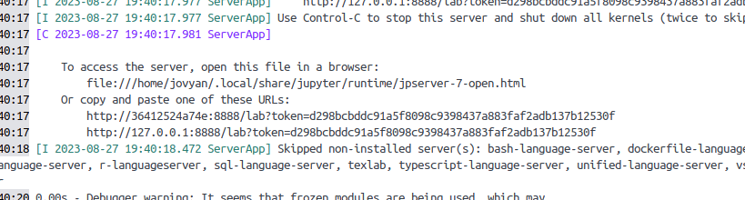

# rl_education
Education materials for Reinforcement learning

## Setup

### 1. Clone the repository

Run the following command to clone the repo:
`git clone https://github.com/Fortuz/rl_education.git`

### 2. Install Docker

- **Windows, Mac**
You can install Docker from this link: https://www.docker.com/products/docker-desktop/
- **Linux**
Use your distro's package manager. On Arch, you need to
install the `docker` and `docker-desktop`AUR packages.
  
### 3. Build the image

Navigate to the project root directory, and use this command to build the image. (It takes a few minutes to complete)
`docker build . -t notebook`

### 4. Start the container

Navigate to the project root directory and run this command:
`docker run -p 8888:8888 --name notebook -v ${PWD}:/home/jovyan/work/ -it notebook`

The output will contain two links:

Use one of them to open the notebook. You can stop the container by pressing `Ctrl-C` twice, or clicking the stop button in the Docker Desktop app.

### Starting the container after setup

To start the container, you have two options:

- **CLI**
Run `docker start --attach notebook` and use one of the links to
open the notebook.
- **GUI**
  - Open the Docker Desktop app
  - Navigate to 'Containers' in the menu
  - Click on 'notebook'
  - Click the play button in the upper right corner
  - Use one of the links in the console output to open the notebook
